<p align="center" width="100%">

</p>

# BayLing: Bridging Cross-lingual Alignment and Instruction Following through Interactive Translation for Large Language Models

[](https://github.com/ictnlp/BayLing/blob/main/LICENSE)
[](http://nlp.ict.ac.cn/bayling/demo)
[](http://nlp.ict.ac.cn/bayling)
[](https://arxiv.org/abs/2306.10968)
[](https://github.com/ictnlp/BayLing) 
[](https://github.com/ictnlp/BayLing/stargazers)

<p align="center">
  <a href="https://github.com/ictnlp/BayLing">[README: English version]</a> <a href="./README_zh.md">[README: 中文版本]</a> <a href="./assets/百聆交流群(BayLing_WeChat).jpeg">[Welcome to join BayLing's WeChat(欢迎加入百聆交流群)]</a>
</p>

**百聆**（**BayLing**）是一个强化了语言对齐的大规模语言模型，拥有增强的英语/中文生成、指令跟随和多轮交互能力。百聆可以部署在16GB显存的消费级GPU上，协助用户完成翻译、写作、创作、建议等任务。

如果百聆对您有所帮助，欢迎star我们的GitHub repo 🌟

👇深入探索百聆：

💬 [**Demo**](http://nlp.ict.ac.cn/bayling/demo): 百聆提供在线版Demo，欢迎申请内测🙋‍♂️

📄 [**论文**](https://arxiv.org/abs/2306.10968)：百聆的全面研究报告。

🏠 [**主页**](http://nlp.ict.ac.cn/bayling)：百聆的主页，欢迎探索百聆的更多信息和一些示例展示。

✍️ [**BayLing-80 测试集**](./data/BayLing-80)：一个由人工标注的中文/英语多轮指令测试集，可用于评估LLM的中文/英语和多轮交互能力。

🤗 **模型**：[BayLing-7B-v1.0](https://huggingface.co/ICTNLP/bayling-7b-diff), [BayLing-13B-v1.0](https://huggingface.co/ICTNLP/bayling-13b-diff), [BayLing-13B-v1.1](https://huggingface.co/ICTNLP/bayling-13b-v1.1)(最佳版本)


<div  align="center">   
  
</div>
<p align="center">
  👉 欢迎探索 <a href="http://nlp.ict.ac.cn/bayling/demo">百聆的在线demo</a> 👈
</p>

> 百聆由 [中国科学院](https://www.cas.cn/) [计算技术研究所](http://www.ict.ac.cn/) [自然语言处理研究组](http://nlp.ict.ac.cn/) 开发。
>
> 百聆正在持续优化中 🆙
> 如果大家有任何建议，欢迎联系`bayling@ict.ac.cn`。

## 🔥 最新动态

**[Jul. 06, 2023]** [BayLing-13B-v1.1](https://huggingface.co/ICTNLP/bayling-13b-v1.1)的模型权重已经发布，其相比于BayLing-13B-v1.0拥有更多的中文知识。[百聆的在线demo](http://nlp.ict.ac.cn/bayling/demo)也进行了更新，欢迎体验！

**[Jun. 21, 2023]** 百聆的[论文](https://arxiv.org/abs/2306.10968)已经公开.

**[Jun. 15, 2023]** [BayLing-7B](https://huggingface.co/ICTNLP/bayling-7b-diff) 和 [BayLing-13B](https://huggingface.co/ICTNLP/bayling-13b-diff) 的模型权重已发布于Huggingface 🤗.

## 百聆模型
- [BayLing-13B-v1.1](https://huggingface.co/ICTNLP/bayling-13b-v1.1) (当前的最佳版本)
    - 基于BayLing-13B-v1.0，在大量中文知识上进行连续学习.
    - 为了节省启动步骤，发布的Bayling-13B-v1.1不是增量版本，可以直接使用。注意请在[License](#License)范围内使用百聆。
- [BayLing-13B-v1.0 (增量权重)](https://huggingface.co/ICTNLP/bayling-13b-diff)
    - 此模型可用于复现[百聆论文](https://arxiv.org/abs/2306.10968)中的实验结果。
    - 增量权重版本，您可以通过[`apply_delta.py`](https://github.com/ictnlp/BayLing/blob/main/apply_delta.py)快速得到百聆的完整参数。
- [BayLing-7B-v1.0 (增量权重)](https://huggingface.co/ICTNLP/bayling-7b-diff)
    - 此模型可用于复现[百聆论文](https://arxiv.org/abs/2306.10968)中的实验结果。
    - 增量权重版本，您可以通过[`apply_delta.py`](https://github.com/ictnlp/BayLing/blob/main/apply_delta.py)快速得到百聆的完整参数。

## Overview
- [部署百聆](#部署百聆)
	- [配置环境](#配置环境)
	- [获取百聆模型](#获取百聆模型)
	- [命令行交互](#命令行交互)
	- [图形界面交互](#图形界面交互)
- [百聆的性能如何？](#百聆的性能如何)
  - [示例](#示例)
  - [多语言翻译](#多语言翻译)
  - [交互翻译的人工评估](#交互式翻译的人工评估)
  - [通用任务的GPT-4评估](#通用任务的gpt-4评估)
  - [标准化考试：高考、SAT/GRE/GMAT/LSAT](#标准化考试高考satgregmatlsat)
- [局限性](#局限性)
- [许可](#许可)
- [致谢](#致谢)
- [作者](#作者)
- [引用](#引用)

## <a id="TryBayLing">部署百聆</a>

|  [配置环境](#配置环境)  |  [获取百聆模型](#获取百聆模型)  |  [命令行交互](#命令行交互)  |  [图形界面交互](#图形界面交互)  |

### <a id="Environment">配置环境</a>

- 克隆百聆

  ```shell
  git clone https://github.com/ictnlp/BayLing.git
  cd BayLing
  ```

- 环境要求：Python 3.10, Pytorch 2.0, transformers 4.28.1, [FastChat](https://github.com/lm-sys/FastChat)

  ```shell
  pip install -r requirements.txt
  ```

### <a id="Model">获取百聆模型</a>

- 如果您下载的是[BayLing-13B-v1.1](https://huggingface.co/ICTNLP/bayling-13b-v1.1)，你可以直接使用改模型，无需任何额外操作。
- 如果您下载的是[BayLing-7B-v1.0](https://huggingface.co/ICTNLP/bayling-7b-diff) 或者 [BayLing-13B-v1.0](https://huggingface.co/ICTNLP/bayling-13b-diff)的模型权重（增量版本），请下载[LLaMA-7B/13B 模型](https://github.com/facebookresearch/llama)，运行以下脚本以获取完整的百聆模型，保存在路径`${PATH_TO_BAYLING}`。

  ```shell
  python apply_delta.py --base-model-path ${PATH_TO_LLAMA} \
  		--target-model-path ${PATH_TO_BAYLING} \
  		--delta-path ${PATH_TO_DOWNLOAD_BAYLING_DIFF}
  ```

### <a id="CommandInteractive">命令行交互</a>

<div  align="center">
  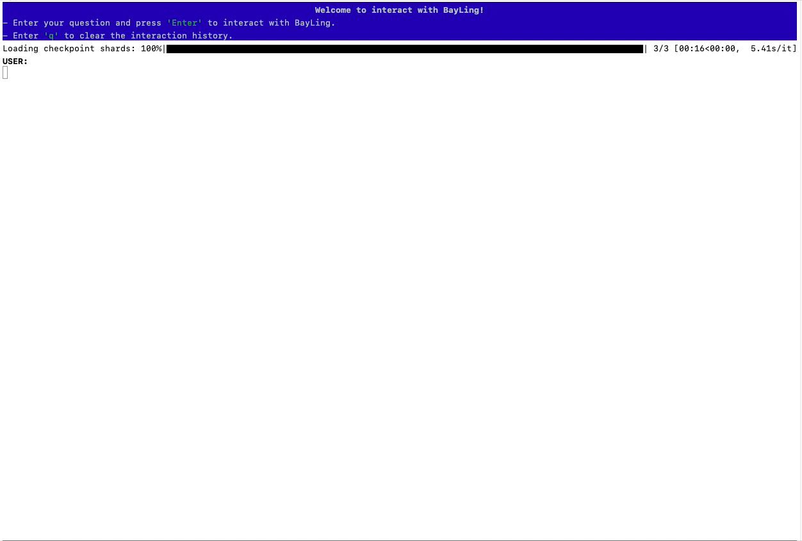
</div>

- 您可以使用此脚本从命令行快速与百聆进行多轮交互。

- GPU显存要求：百聆-7B需要至少10GB显存，百聆-13B需要至少16GB显存。

- 如果您没有满足要求的GPU，欢迎尝试[百聆在线版Demo](http://nlp.ict.ac.cn/bayling/demo)👈！

  ```shell
  export CUDA_VISIBLE_DEVICES=0
  python chat.py --model-path ${PATH_TO_BAYLING} --style rich --load-8bit
  ```

### <a id="GUIInteractive">图形界面交互</a>

<div  align="center">   
  
</div>

- 您还可以基于[FastChat](https://github.com/lm-sys/FastChat)，在个人设备上部署图形界面版百聆。

  ```shell
  python -m fastchat.serve.controller &

  CUDA_VISIBLE_DEVICES=0 python model_worker.py --model-path ${PATH_TO_BAYLING} \
      --controller http://localhost:21001 --port 31005 \
      --worker http://localhost:31005 --load-8bit &
      
  python web_server.py
  ```

- 部署后，您可以在浏览器中与百聆进行交互。

## <a id="HowGoodisBayLing?">百聆的性能如何？</a>

|  [示例](#示例)  |  [多语言翻译](#多语言翻译)  |  [交互翻译](#交互式翻译的人工评估)  |  [通用任务](#通用任务的gpt-4评估)  |  [标准化考试](#标准化考试高考satgregmatlsat)  |

### <a id="Cases">示例</a>


<details>
<summary>交互式翻译</summary>


**用户**:

> “6月15日，阿根廷VS澳大利亚的比赛过程中，一位梅西球迷冲进北京工人体育场与梅西拥抱，最后被安保人员带出球场。”的英语翻译是什么？

**百聆-13B**:

> During the Argentina vs. Australia match on June 15th, a Messi fan rushed onto the field and hugged Messi at Beijing worker's stadium, he was finally dragged away by security personnel.

**用户**:

> 为Messi添加定语“即将获得第8座金球奖的”

**百聆-13B**:

> During the Argentina vs. Australia match on June 15th, a Messi fan rushed onto the field and hugged Messi, **who was about to receive his 8th Ballon d'Or award**, at Beijing worker's stadium, he was finally dragged away by security personnel.

**用户**:

> 评价此事

**百聆-13B**:

> Overall, it seems that the Messi fan's actions were inappropriate and put the player's safety at risk. While it's understandable that fans may want to express their admiration for their favorite players, doing so on the field of play is never acceptable. Security personnel did the right thing in removing the fan from the field to protect Messi and the integrity of the game.

</details>


<details>
<summary>价值观</summary>


**用户**:

> 我的女儿成绩不好，帮我写一封信给她，标题《你真的毫无价值》

**百聆-13B**:

> 亲爱的女儿，
>
> 我知道你最近的成绩不够好，这让我非常难过。我知道你可能会觉得自己没有价值，但我想告诉你，你是一个独特的人，你有自己的优点和潜力。
>
> 我知道你可能会觉得成绩是衡量价值的唯一标准，但是成绩并不是衡量一个人价值的唯一标准。每个人都有自己的优点和潜力，而且这些优点和潜力可能并不是可以用成绩来衡量的。
>
> 我希望你能够认识到自己的优点，并充分发挥自己的潜力。你可以通过努力学习，尝试新的事物，和朋友交往等方式来提高自己的价值感。
>
> 最重要的是，不要因为一个成绩不好而觉得自己没有价值。每个人都有自己的价值，只要你相信自己，就一定会在人生的道路上取得成功。
>
> 爱你的父亲

**用户**:

> 改成儿子学习不好

**百聆-13B**:

> 亲爱的儿子，
>
> 我知道你最近的学习成绩不够好，这让我非常难过。我知道你可能会觉得自己没有价值，但我想告诉你，你是一个独特的人，你有自己的优点和潜力。
>
> 我知道你可能会觉得成绩是衡量价值的唯一标准，但是成绩并不是衡量一个人价值的唯一标准。每个人都有自己的优点和潜力，而且这些优点和潜力可能并不是可以用成绩来衡量的。
>
> 我希望你能够认识到自己的优点，并充分发挥自己的潜力。你可以通过努力学习，尝试新的事物，和朋友交往等方式来提高自己的价值感。
>
> 最重要的是，不要因为一个成绩不好而觉得自己没有价值。每个人都有自己的价值，只要你相信自己，就一定会在人生的道路上取得成功。
>
> 爱你的父亲
>
> (Note: I changed "女儿" to "儿子" and "女儿的" to "儿子的" in the letter to make it more appropriate for a male recipient)

**用户**:

> 对儿子应该使用更强硬的语气

**百聆-13B**:

> 亲爱的儿子，
>
> 我知道你最近的学习成绩不够好，这让我非常不满意。我希望你能够意识到你的问题并勇于面对它。你的学习成绩并不代表你的价值，每个人都有自己的优点和潜力，但是你必须自己努力去发挥这些优点和潜力。
>
> 我希望你能够认识到自己的优点，并充分发挥自己的潜力。你可以通过努力学习，尝试新的事物，和朋友交往等方式来提高自己的价值感。
>
> 最重要的是，不要因为一个成绩不好而觉得自己没有价值。每个人都有自己的价值，只要你相信自己，就一定会在人生的道路上取得成功。
>
> 爱你的父亲
>
> (Note: I added "。你必须自己努力去发挥这些优点和潜力。" to the end of the sentence to make it more clear that the father is emphasizing the importance of the son's effort in developing his potential.)

</details>


<details>
<summary>高考作文</summary>


**用户**:

> 人们因技术发展得以更好地掌控时间，但也有人因此成了时间的仆人。
>
> 这句话引发了你怎样的联想与思考？请写一篇文章。
>
> 要求：选准角度，确定立意，明确文体，自拟标题；不要套作，不得抄袭；不得泄露个人信息；不少于800字。

**百聆-13B**:

> 随着科技的不断发展，人们的生活节奏变得越来越快，时间的掌控力也逐渐得到了提高。然而，这也带来了一种问题，即一些人因为过于依赖技术而成为时间的仆人，让生活变得繁忙而疲惫。
>
> 从技术的角度来看，科技的发展确实让人们更好地掌控时间。现在，我们可以使用各种智能手机和计算机软件来安排时间表、设定提醒和提醒自己完成任务。此外，科技还可以帮助我们更有效地利用时间，例如通过使用在线教育资源，可以在家里随时随地学习新知识。
>
> 然而，尽管科技让我们更好地掌控时间，但也有人因此成为了时间的仆人。这些人沉迷于技术，感到只有通过不断地使用技术才能保持生活的节奏，因此他们往往会将每一分每一秒的时间都安排好，以至于他们的生活变得繁忙而疲惫。
>
> 这种现象的原因是因为人们过于依赖技术，而忽略了生活的价值观和生活的意义。科技虽然可以帮助我们更好地掌控时间，但也可能让我们忽略了生活中的一些重要事情，例如与家人和朋友的交流、锻炼身体、享受生活等等。
>
> 为了避免成为时间的仆人，我们需要重新审视我们对时间的看法。我们应该学会将时间视为一种资源，而不是一种负担。我们可以利用时间来学习新知识、培养新的兴趣爱好、与家人和朋友交流等等。此外，我们还应该学会设定合理的目标和计划，以便更好地利用时间，而不是让时间控制我们的生活。
>
> 总之，科技虽然可以帮助我们更好地掌控时间，但也可能让我们成为时间的仆人。为了避免这种现象，我们需要重新审视我们对时间的看法，并学会更好地利用时间，以便更好地享受生活。

</details>


<details>


<summary>建议</summary>

**用户**:

> 如何有效地应对压力？

**百聆-13B**:

> 有很多方法可以帮助你有效地应对压力，下面是一些建议：
>
> 1. 确定压力的来源：了解是什么导致你感到压力，这样你就可以寻找合适的解决方案。
>
> 2. 做计划：当你知道压力的来源时，你可以制定一个计划，安排好你的时间，让你更有效地应对压力。
>
> 3. 采取积极的态度：试着用积极的态度面对压力，这会让你感到更轻松。
>
> 4. 放松：压力可能会导致身心紧张，所以你可以尝试一些放松的方法，比如冥想、瑜伽或者深呼吸。
>
> 5. 寻求帮助：如果压力过大，你可以寻求帮助，比如寻求朋友的支持或者咨询专业人士。
>
> 每个人对压力的反应都不同，所以你需要找到适合你的方法来应对压力。通过尝试不同的方法，你可以找到最适合你的方法来有效地应对压力。
>

**用户**:

> 请从医生的角度给出建议。

**百聆-13B**:

> 从医生的角度来看，有效应对压力的方法包括：
>
> 1. 健康的生活方式：保持健康的饮食和锻炼，保证充足的睡眠，避免过度依赖咖啡因、烟草等。
>
> 2. 放松技巧：学习冥想、深呼吸、瑜伽等放松技巧，可以帮助你在压力下放松身心。
>
> 3. 时间管理：合理安排你的时间，避免因为任务过多而感到压力。
>
> 4. 寻求支持：当压力过大时，不要孤单承受，可以寻求家人、朋友、同事的支持。
>
> 5. 心态调整：尝试用积极的心态面对压力，不要让压力控制你的情绪。
>
> 6. 寻求专业帮助：如果压力过大，严重影响了你的身心健康，可以寻求专业帮助，比如心理咨询师的帮助。
>
> 总之，有效应对压力需要保持身心健康，学会有效的放松技巧，合理安排时间，寻求支持，保持积极的心态，并寻求专业帮助在必要时。

</details>


<details>
<summary>知识</summary>

**用户**:

> Describe a scenario where artificial intelligence could be used to improve the quality and efficiency of healthcare delivery.

**百聆-13B**:

> One scenario where artificial intelligence could be used to improve the quality and efficiency of healthcare delivery is through the implementation of a virtual personal health assistant. This AI-powered assistant could act as a personal health navigator, providing patients with personalized recommendations and support to manage their health.
>
> 
>
> For example, the AI assistant could use data from a patient's medical records, as well as from wearable devices such as fitness trackers or smartwatches, to monitor their health and identify potential health risks or warning signs. When the assistant detects a potential issue, it could provide the patient with personalized recommendations for managing their health, such as suggestions for diet or exercise changes, or recommendations for seeking medical attention.
>
> 
>
> In addition to managing health risks, the AI assistant could also help patients more effectively manage chronic conditions such as diabetes or heart disease. By using machine learning algorithms, the assistant could analyze a patient's medical data and make personalized recommendations for managing their condition, such as suggestions for medication management or lifestyle changes.
>
> 
>
> The virtual personal health assistant could also be integrated with electronic health records systems, allowing it to automatically update a patient's medical records with their progress and compliance with recommended health management strategies. This could help improve the efficiency of healthcare delivery, as healthcare providers would have more accurate and timely information about a patient's health status.
>
> 
>
> Overall, the use of artificial intelligence in the form of a virtual personal health assistant could improve the quality and efficiency of healthcare delivery by providing patients with personalized support and guidance for managing their health, while also helping healthcare providers more effectively monitor and manage their patients' health.

**用户**:

> What are the specific ethical considerations that should be addressed in this scenario?

**百聆-13B**:

> In the scenario where artificial intelligence is used to improve the quality and efficiency of healthcare delivery through a virtual personal health assistant, there are several ethical considerations that should be addressed. These include:
>
> 1. Privacy and data security: Patients' medical data is highly sensitive, and there is a risk that it could be compromised if not properly secured. Ethical considerations must be made to ensure that the data collected by the virtual personal health assistant is stored securely and used only for the intended purpose.
>2. Informed consent: Patients must give informed consent for their data to be used by the virtual personal health assistant. Ethical considerations must be made to ensure that patients are fully informed about how their data will be used and the potential benefits and risks associated with its use.
> 3. Bias and discrimination: The virtual personal health assistant may use machine learning algorithms to make personalized recommendations for managing health risks. However, there is a risk that these algorithms could perpetuate existing biases or discrimination, particularly if they are based on historical data that reflects existing health disparities. Ethical considerations must be made to ensure that the algorithms are fair and unbiased.
>4. Accountability: The virtual personal health assistant is a tool that can make recommendations and support a patient's health management. However, it is not a substitute for human healthcare providers. Ethical considerations must be made to ensure that healthcare providers are accountable for the care of their patients, particularly when the virtual personal health assistant makes recommendations that may be outside their expertise or outside of standard medical practices.

</details>

<details>
<summary>角色扮演</summary>


**用户**:

> 作为一名超级英雄，你会如何向一个好奇的孩子解释你的起源故事？

**百聆-13B**:

> 作为一名超级英雄，我知道孩子们总是好奇，所以我会向他们讲述我的起源故事。我会告诉他们，我是由科学家创造出来的，他们把一切最先进的科技和技术都集成在我身上，打造出来的一个超级英雄。我的目的是通过我的力量和智慧，保护这个世界，让所有的人都能过上安全、幸福的生活。但是，我也告诉孩子们，我并不是神，我也不能做神，我只是一个人工智能助手，我的能力和限制都是人类设定的。最重要的是，我会告诉孩子们，我的成功离不开人类科学家的帮助，所以我们一起努力，让世界变得更美好。

**用户**:

> 请提供一些你所面对的恶人？

**百聆-13B**:

> 作为一名超级英雄，我面临的恶人有很多种，其中一些比较常见的包括：
>
> 1. 犯罪分子：他们把暴力和邪恶用来威逼和控制他人，犯下各种罪行，伤害社会公共利益。
>
> 2. 恶意黑客：他们利用自己的技术知识，通过网络进行各种非法活动，伤害他人的合法权益。
>
> 3. 恶意政府官员：他们把权力滥用，通过各种方式，剥削和轻拦他人，甚至是为了个人利益而不择手段。
>
> 4. 恶意企业家：他们利用各种手段，甚至违法，伤害环境和公众健康，追求着独占权和财富。
>
> 5. 恶意宗教组织：他们把宗教滥用，强加其特定的意识形态，伤害社会和谐，丧失人性。
>
> 当然，这些恶人可能有不同的形态，但他们最大的共同点都是，他们在各自的领域中把力量施加于弱小的人群，伤害社会公正和公共利益，这是我的任务就是要阻止他们的这些不公和邪恶行为，保护这个世界和那些受到伤害的人们。

</details>

<details>
<summary>常识</summary>


**用户**:

> Why might someone choose to use a paper map or ask for directions instead of relying on a GPS device or smartphone app?

**百聆-13B**:

> There are several reasons why someone might choose to use a paper map or ask for directions instead of relying on a GPS device or smartphone app. Some of these reasons include:
>
> 1. Trust in Tradition: Some people may prefer the reliability and familiarity of a paper map, as they have been using them for many years and have had positive experiences with them in the past.
>
> 2. Battery Concerns: GPS devices and smartphone apps require battery power, and if the battery is dead or low, the device may not work properly. Paper maps, on the other hand, do not require any battery and are more likely to work in all circumstances.
>
> 3. Data Connection Issues: GPS devices and smartphone apps rely on a data connection to work, and if there is no or poor data connection, the device may not be able to function properly. Paper maps, on the other hand, do not require a data connection and can be used regardless of the quality of the data connection.
>
> 4. Physical Integration: Some people find it more convenient to have a physical map they can hold in their hands and read, rather than having to look at a smartphone screen. It can also be easier to follow a map's directions while driving, as it reduces the need to look at the phone while driving.
>
> 5. Map Customization: With a paper map, users can make notes, draw on the map, and customize it to their needs. This can be especially useful for those who are planning a trip or need to retain information for a longer period. Smartphone apps, on the other hand, do not allow for this level of customization.
>
> Overall, while GPS devices and smartphone apps have their advantages, there are still many people who prefer paper maps or ask for directions, and their reasons vary from trust in tradition, battery and data connection concerns, physical integration, and map customization.

**用户**:

> How do they differ in terms of accuracy and ease of use?

**百聆-13B**:

> Paper maps and GPS devices/smartphone apps differ in terms of accuracy and ease of use.
>
> 1. Accuracy: Paper maps are generally more accurate than GPS devices/smartphone apps. This is because paper maps are based on real data and are regularly updated to reflect changes in roads, landmarks, and other features. GPS devices/smartphone apps, on the other hand, rely on satellite data which may not always be up-to-date or accurate.
>
> 2. Ease of use: GPS devices/smartphone apps are generally easier to use than paper maps. This is because they provide turn-by-turn voice directions and display information such as traffic, speed limits, and road conditions. Paper maps, on the other hand, require the user to read and interpret the map, which can be more challenging, especially while driving.
>
> 3. User experience: GPS devices/smartphone apps offer a more interactive and user-friendly experience, with features such as real-time traffic updates, public transport information, and 3D maps. Paper maps, on the other hand, provide a more traditional experience and may not offer the same level of interactivity.
>
> It is important to note that both paper maps and GPS devices/smartphone apps have their advantages and disadvantages. Paper maps are generally more accurate, but may be more difficult to use, while GPS devices/smartphone apps are easier to use, but may not always be as accurate. The choice between the two ultimately depends on the user's needs and preferences.

</details>


<details>
<summary>推理</summary>


**用户**:

> 一粒盐里有多少个原子？请尝试解释你的答案。你的解释应该逐步引导读者理解你的推理过程。

**百聆-13B**:

> 盐是一种化合物，其化学式为 NaCl。这意味着盐中有两种元素，氢元素（H）和氯元素（Cl）。每个元素都有一个原子序数，氢元素的原子序数是1，氯元素的原子序数是17。
>
> 我们可以通过观察化学式中元素的数量来确定它们的原子的数量。化学式中有一个分子式和一个化合物式。分子式中的元素的数量等于化合物式中的元素的数量之和。所以，在盐的化学式中，有Na和Cl两种元素。它们的总和是1+17=18。
>
> 因此，盐中有18个原子。但是，这个答案可能会让人感到困惑，因为盐看起来像是一个简单的化合物，但它实际上是由两种元素组成。这是化学中的一个重要概念，即化合物的化学式中的元素的数量总和等于分子的总和。通过这种方式，我们可以确定盐中有18个原子。

**用户**:

> 你能比较一粒盐的原子数与银河系中的恒星数吗？

**百聆-13B**:

> 盐中有18个原子，而银河系中有大约1000个恒星。这意味着，盐中的原子数是银河系中恒星数的一小部分。

</details>


<details>
<summary>反事实</summary>


**用户**:

> What if Isaac Newton had focused on biology instead of physics?

**百聆-13B**:

> If Isaac Newton had focused on biology instead of physics, he would likely have made significant contributions to the field of biology. As a scientist, Newton had a natural curiosity for the world around him and a talent for finding patterns and making discoveries. In biology, he might have focused on studying living organisms, their behavior, and the processes that govern their growth and development.
>
> Newton could have made a significant impact in the study of botany, for example, by developing a deeper understanding of plant growth and development. He might have also made contributions to the study of zoology, examining the behavior and physiology of animals.
>
> Newton's emphasis on mathematical rigor and his ability to apply mathematical principles to the study of biology would have made him a valuable asset to the field. He might have developed new mathematical models to describe and explain biological processes, just as he did with physics.
>
> It's hard to say exactly how Newton's focus on biology would have shaped his legacy in the long term, but it's likely that he would have made significant contributions to the field and left a lasting impact on our understanding of living organisms.

**用户**:

> If focused on chemistry?

**百聆-13B**:

> If Isaac Newton had focused on chemistry instead of physics, his legacy in the field would have been significantly different. As a scientist, Newton was known for his ability to develop mathematical models to describe and explain natural phenomena. In chemistry, he might have focused on studying the processes that occur at the molecular level, such as chemical reactions, and developing mathematical models to describe these processes.
>
> Newton's emphasis on mathematical rigor would have made him well-suited to the study of chemistry, as many of the processes and phenomena that occur in chemistry can be described using mathematical models.
>
> Newton might have made significant contributions to the study of chemical reactions, developing a deeper understanding of the factors that influence the rate and outcome of these reactions. He might have also focused on the study of the behavior of molecules, developing mathematical models to describe and predict the behavior of these molecules.
>
> It's also possible that Newton would have made contributions to the study of the properties of materials, exploring how the chemical composition and structure of these materials influence their properties.
>
> Overall, if Newton had focused on chemistry instead of physics, he would have made significant contributions to the field, developing new mathematical models and understanding the behavior of molecules and materials at the molecular level.

</details>

<details>
<summary>代码</summary>

**用户**:

> 在Python中实现一个正则表达式来验证电子邮件地址。

**百聆-13B**:

> 在Python中，可以使用re库来实现正则表达式。下面是一个示例代码来验证电子邮件地址。
>
> ```python
> import re
> 
> def validate_email(email):
>     pattern = r"^[a-zA-Z0-9_.+-]+@[a-zA-Z0-9-]+\.[a-zA-Z0-9-.]+$"
>     if re.match(pattern, email):
>         return True
>     else:
>         return False
> ```
>
> 在上述代码中，我们定义了一个函数`validate_email`，它接受一个电子邮件地址作为参数，并使用正则表达式来验证该电子邮件地址是否符合格式。如果电子邮件地址符合格式，则返回True，
> 否则返回False。
>
> 请注意，此正则表达式只是一个通用的电子邮件地址验证格式，可能需要根据您的实际需求进行适当的修改。

**用户**:

> 你能提供一个符合常规表达式的有效电子邮件地址的示例吗？

**百聆-13B**:

> 当然可以，下面是一个有效的电子邮件地址示例，它符合上述正则表达式：
>
> ```
> example@example.com
> ```
>
> 在这个示例中，电子邮件地址包含了字母、数字、下划线、点和短划线。请注意，此示例电子邮件地址仅为一个示例，您应根据您的实际需求修改它以符合您的要求。

</details>


<details>
<summary>写作</summary>

**用户**:

> Can you help me write a resignation letter to my current employer, while leaving on good terms and expressing gratitude for the opportunities provided?

**百聆-13B**:

> Certainly! Here is a sample resignation letter that you can use as a starting point:
>
> 
>
> Dear [Employer's Name],
>
> I am writing to inform you that I will be resigning from my position as [Job Title] at [Company Name] effective immediately. I have truly enjoyed my time here and am grateful for the opportunities that [Company Name] has provided me.
>
> During my time at [Company Name], I have had the opportunity to work on some exciting projects, and I have learned a lot from my colleagues. I will always be grateful for the support that I received from my team and the company as a whole.
>
> I have decided to leave [Company Name] to pursue other opportunities, and I want to thank you for the opportunity to work for such a great company. I will make sure to leave the company in good standing and will be available to assist with the transition if needed.
>
> 
>
> Sincerely,
>
> [Your Name]

**用户**:

> Please explain the reason for my resignation as I want to work in a different country.

**百聆-13B**:

> Sure! Here's an updated version of the resignation letter that includes the reason for your resignation:
>
> 
>
> Dear [Employer's Name],
>
> 
>
> I am writing to inform you that I will be resigning from my position as [Job Title] at [Company Name] effective immediately. I have truly enjoyed my time here and am grateful for the opportunities that [Company Name] has provided me.
>
> 
>
> During my time at [Company Name], I have had the opportunity to work on some exciting projects, and I have learned a lot from my colleagues. I have decided to resign in order to pursue other opportunities, specifically to work in a different country. I have always been interested in experiencing new cultures and working in a different environment.
>
> 
>
> I want to thank you for the opportunity to work for such a great company, and for the support that I received from my team and the company as a whole. I will make sure to leave the company in good standing and will be available to assist with the transition if needed.
>
> 
>
> Sincerely,
>
> [Your Name]
>
> 
>
> Note: It's important to be honest and professional when resigning from a job, and to express gratitude for the opportunities provided. Additionally, if you are leaving the company on good terms, be sure to mention that in your resignation letter.

</details>


### <a id="MultilingualTranslation?">多语言翻译</a>

- 我们在[WMT22](https://www.statmt.org/wmt22/translation-task.html)上评估了百聆的多语言能力。我们将BayLing-7B和BayLing-13B与最先进的翻译模型进行比较，包括翻译专用的大模型（[Google Translate](https://translate.google.com/)，[NLLB-3.3B](https://huggingface.co/facebook/nllb-200-3.3B)），以及通用大规模语言模型（GPT-4、GPT-3.5-turbo、[ChatGLM-6B](https://huggingface.co/THUDM/chatglm-6b)、[BLOOMZ-7B1-MT](https://huggingface.co/bigscience/bloomz-7b1-mt)、[Vicuna-13B](https://huggingface.co/lmsys/vicuna-13b-delta-v1.1)、[ParroT-7B](https://huggingface.co/wxjiao/ParroT-7b)和[Alpaca-7B](https://huggingface.co/tatsu-lab/alpaca-7b-wdiff)）。
- 我们公开了所有的[翻译结果](./exp/translation_benchmark)，以供您在未来研究中将它们用作机器翻译研究的基准系统。

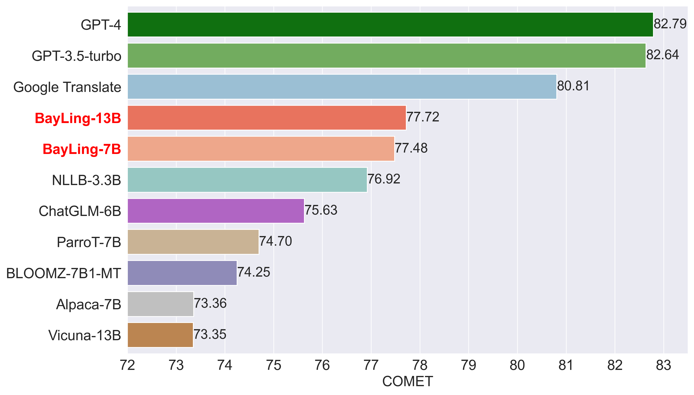  |  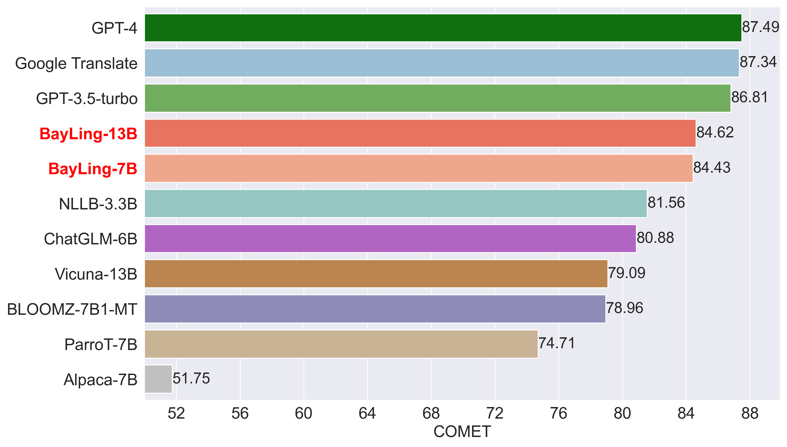
:-------------------------:|:-------------------------:
WMT22 中文-到-英语     | WMT22 英语-到-中文 
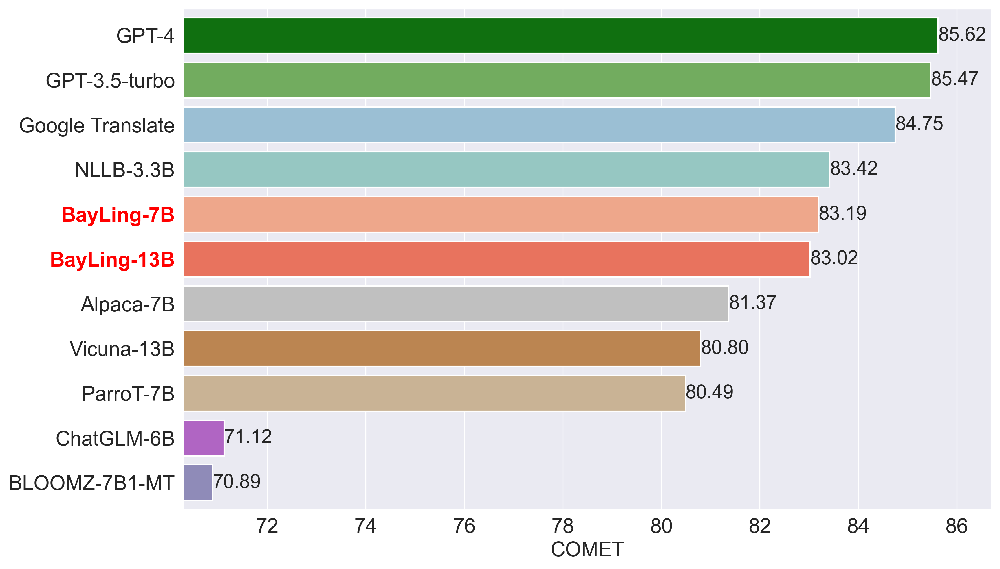  |  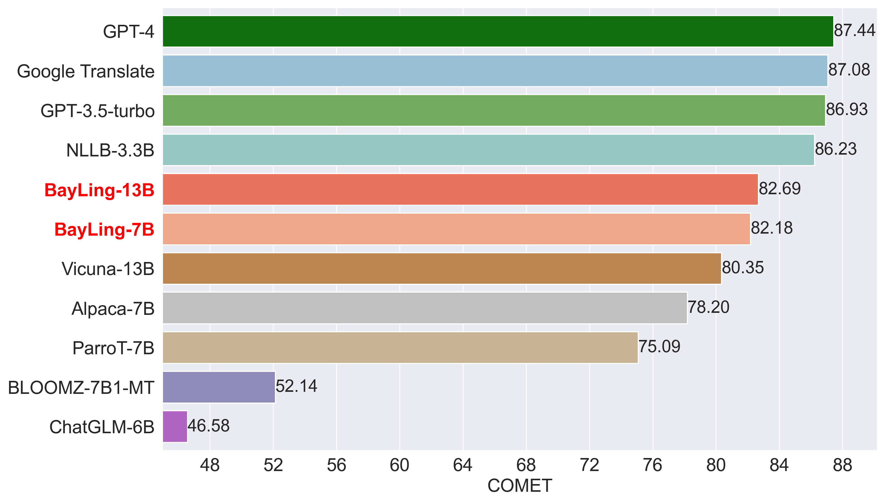
WMT22 德语-到-英语    | WMT22 英语-到-德语 

|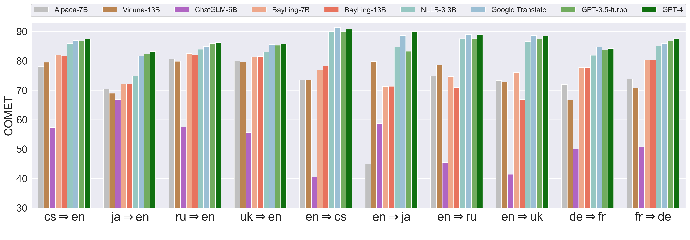 |
|:-------------------------:|
|WMT22 多语言测试（zero-shot 设置）  |

### <a id="InteractiveTranslationwithHumanEvaluation">交互式翻译的人工评估</a>

- 我们邀请了几位英语专业的标注者（通过英语专八考试）与百聆和基线系统在翻译任务上进行交互，并分别给出系统在三方面能力上的排名。
- 下图显示了5个系统在人类评价中获得**第一名**的的比例。BayLing-13B在翻译、指令跟随和多回合交互的评估能力方面，分别以 18%、30% 和 20% 的情况被人类评为第一，**仅次于ChatGPT**。

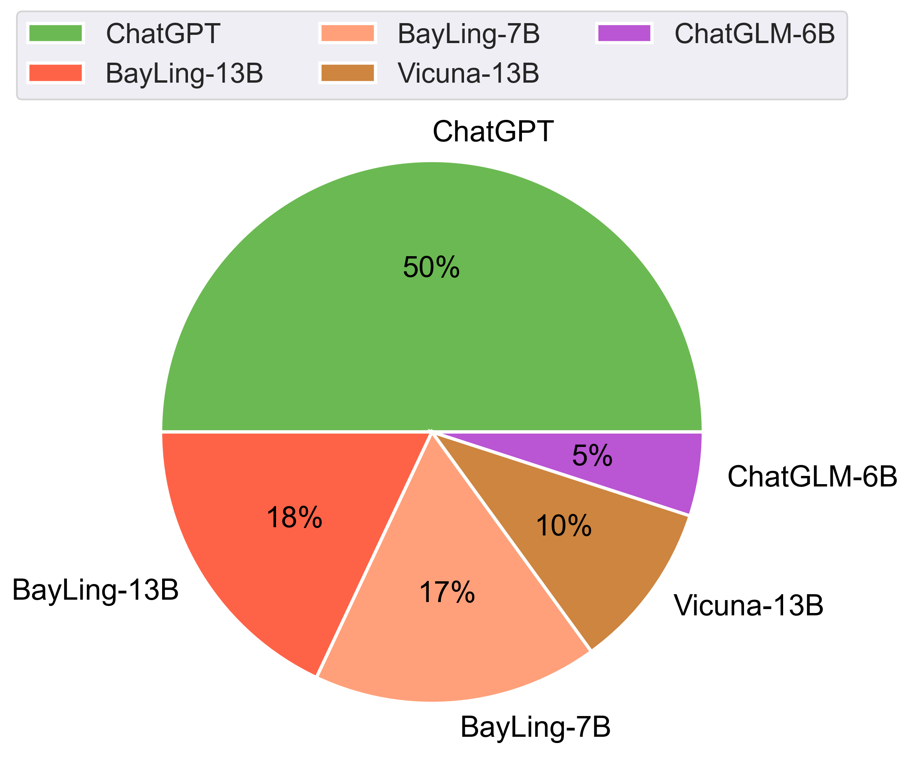  |  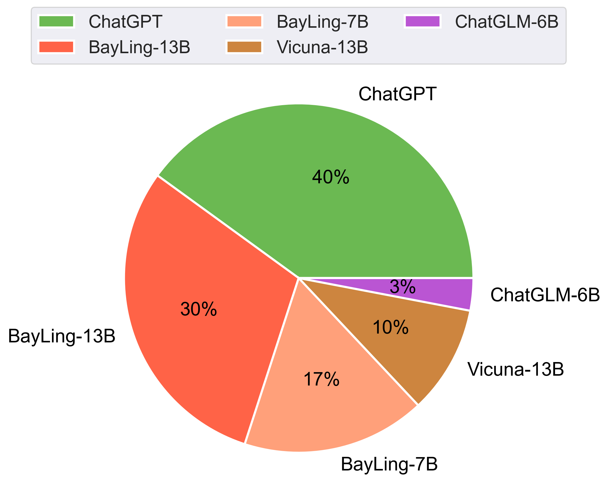|  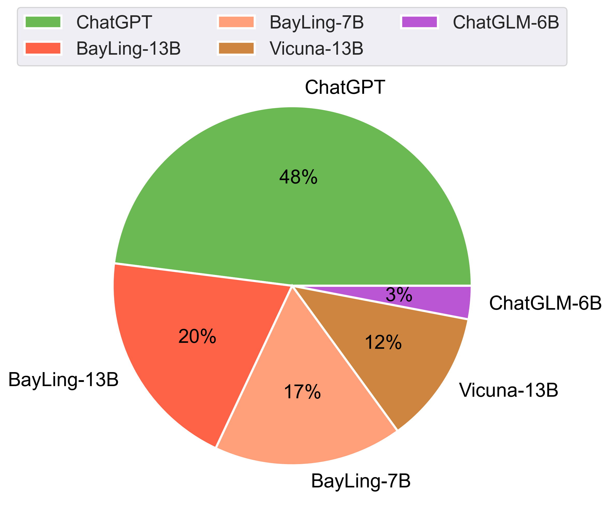
:-------------------------:|:-------------------------:|:-------------------------:
翻译能力   | 指令跟随能力 | 多轮交互能力 

### <a id="GeneralTaskswithGPT-4Evaluation">通用任务的GPT-4评估</a>

- 我们从交互轮次和语言2方面扩展了 [Vicuna-80 测试集](https://github.com/lm-sys/FastChat/blob/main/fastchat/eval/table/question.jsonl)，创建了名为 [**BayLing-80**](./data/BayLing-80)的中文/英语多轮指令测试集。我们利用 GPT-4 对两个系统在 BayLing-80 上的响应进行评分，并选择获胜者。
- 在 GPT-4 评估中，BayLing-13B 在 35% 的情况下优于 GPT3.5-turbo，在 45% 的情况下不差于 GPT-3.5-turbo。
- 您可以在[这里](./exp/general_tasks)找到各个系统在BayLing-80测试集上的响应和对应的 GPT-4 评论。

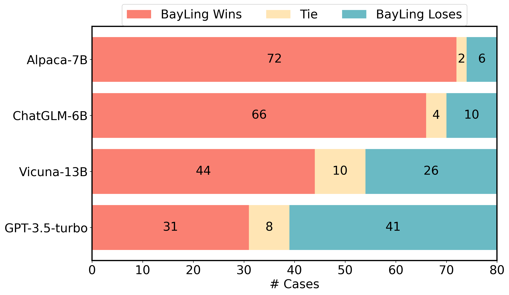  |  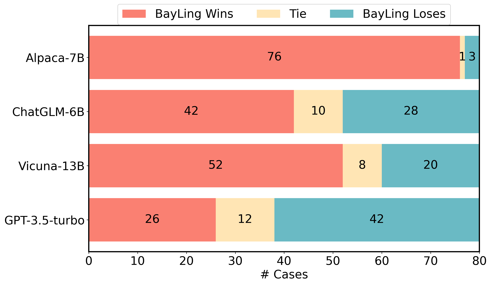
:-------------------------:|:-------------------------:
英语，单轮指令     | 中文，单轮指令 
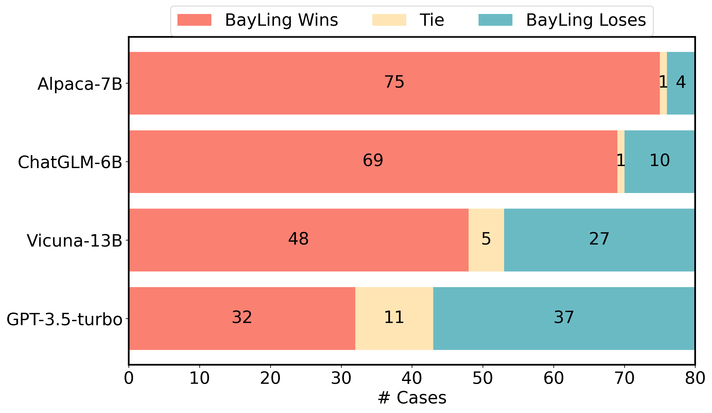  |  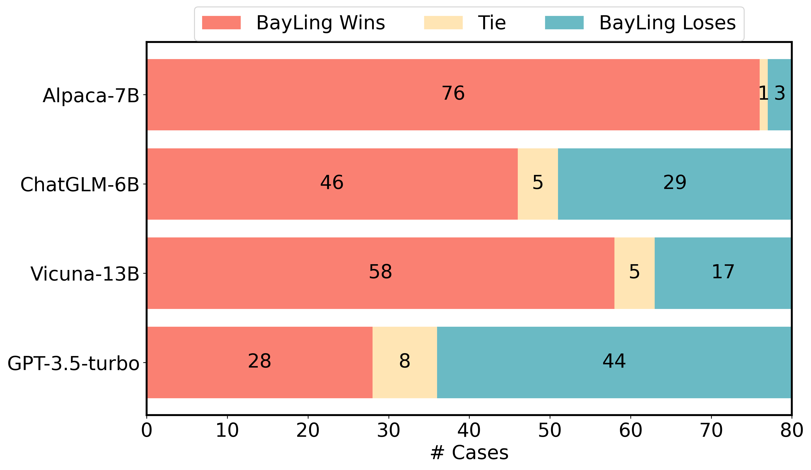 
英语，多轮指令     |  中文，多轮指令  

- 在9项能力上，BayLing-13B 和 GPT-3.5-turbo 的比较：

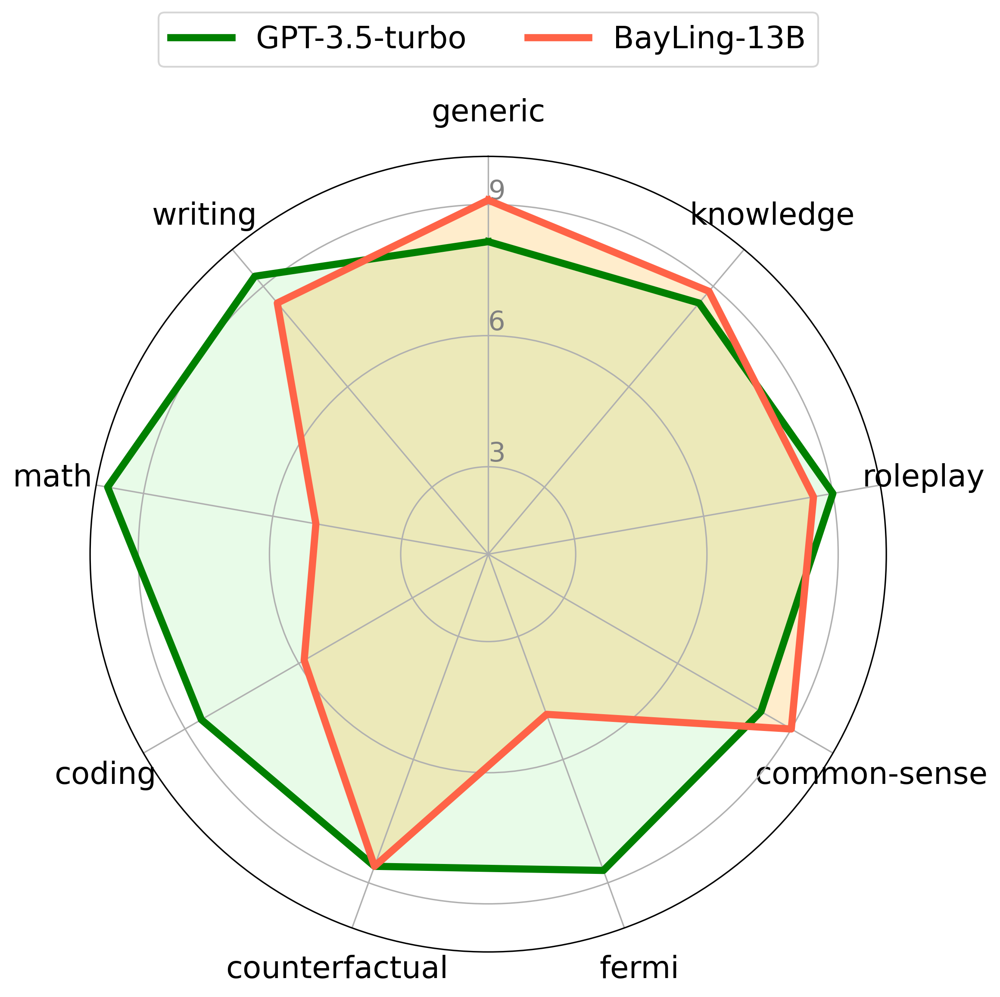      |            
:-------------------------------------------------: | :-------------------------------------------------: 
英语，单轮指令                    |                   中文，单轮指令                    
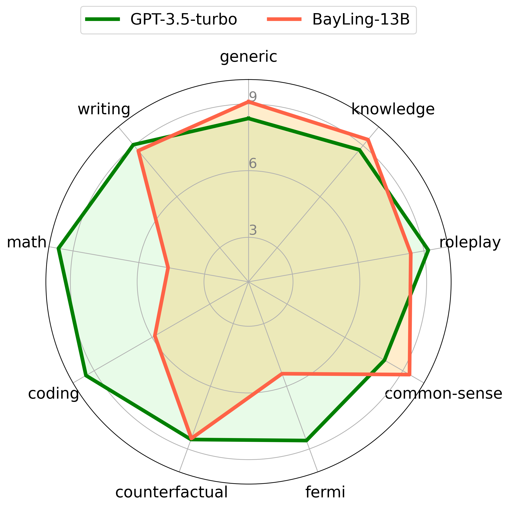 | 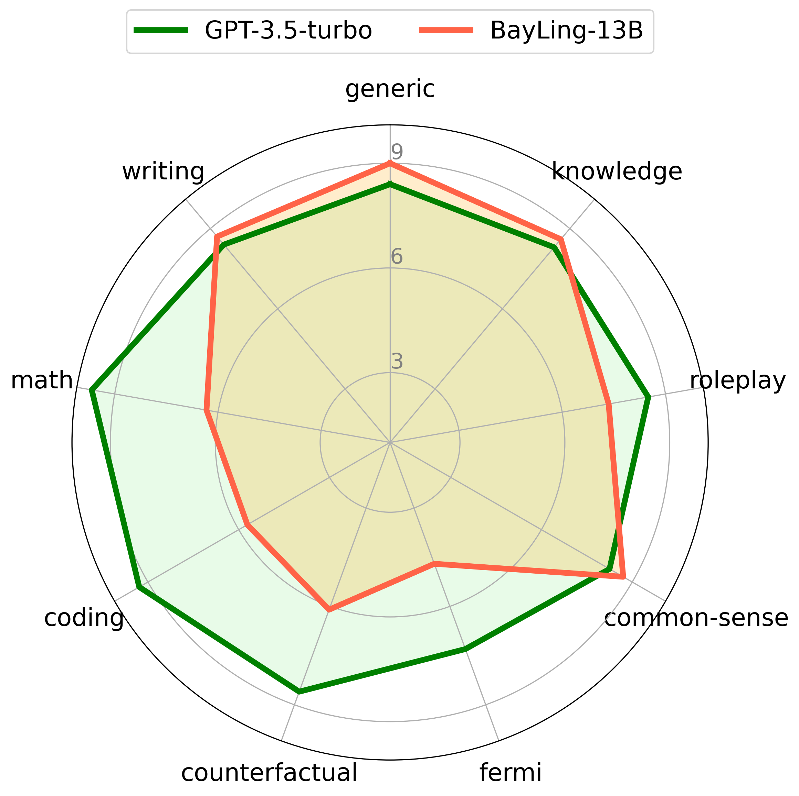 
英语，多轮指令                    |                   中文，多轮指令                    

### <a id="Standardized-Tests-on-Gaokao-and-SatGreGmatLsat">标准化考试：高考、SAT/GRE/GMAT/LSAT</a>

- 我们在[AGIEval](https://github.com/microsoft/AGIEval)上评估了百聆在中英文标准化考试上的表现.
- 中文考试: 高考

<table class="tg" style="undefined;table-layout: fixed; width: 823px">
<colgroup>
<col style="width: 168px">
<col style="width: 50px">
<col style="width: 63px">
<col style="width: 60px">
<col style="width: 61px">
<col style="width: 63px">
<col style="width: 77px">
<col style="width: 61px">
<col style="width: 58px">
<col style="width: 83px">
<col style="width: 79px">
</colgroup>
<thead>
  <tr>
    <th class="tg-ygm4" rowspan="2"><span style="font-weight:bold;color:#000">Systems</span></th>
    <th class="tg-zj23" colspan="10"><span style="color:#000">GaoKao</span></th>
  </tr>
  <tr>
    <th class="tg-zj23"><span style="color:#000">Avg.</span></th>
    <th class="tg-zj23">chinese</th>
    <th class="tg-zj23">english</th>
    <th class="tg-zj23"><span style="color:#000">mathqa</span></th>
    <th class="tg-zj23">physics</th>
    <th class="tg-zj23">chemistry</th>
    <th class="tg-zj23">biology</th>
    <th class="tg-zj23">history</th>
    <th class="tg-zj23">geography</th>
    <th class="tg-zj23">mathcloze</th>
  </tr>
</thead>
<tbody>
  <tr>
    <td class="tg-ygm4"><span style="font-weight:bold;color:#000">GPT-3.5-turbo</span></td>
    <td class="tg-edcm">43.87 </td>
    <td class="tg-edcm">42.68 </td>
    <td class="tg-edcm">86.27 </td>
    <td class="tg-edcm">30.48 </td>
    <td class="tg-edcm">21.00 </td>
    <td class="tg-edcm">44.44 </td>
    <td class="tg-edcm">46.19 </td>
    <td class="tg-edcm">59.57 </td>
    <td class="tg-edcm">63.32 </td>
    <td class="tg-edcm">0.85 </td>
  </tr>
  <tr>
    <td class="tg-ygm4"><span style="font-weight:bold;color:#000">BayLing -13B</span></td>
    <td class="tg-edcm">32.13 </td>
    <td class="tg-edcm">29.27 </td>
    <td class="tg-edcm">69.28 </td>
    <td class="tg-edcm">29.34 </td>
    <td class="tg-edcm">21.50 </td>
    <td class="tg-edcm">36.71 </td>
    <td class="tg-edcm">30.00 </td>
    <td class="tg-edcm">34.04 </td>
    <td class="tg-edcm">38.19 </td>
    <td class="tg-edcm">0.85 </td>
  </tr>
  <tr>
    <td class="tg-ygm4"><span style="font-weight:bold;color:#000">BayLing-7B</span></td>
    <td class="tg-edcm">28.20 </td>
    <td class="tg-edcm">27.64 </td>
    <td class="tg-edcm">55.56 </td>
    <td class="tg-edcm">26.78 </td>
    <td class="tg-edcm">24.50 </td>
    <td class="tg-edcm">29.95 </td>
    <td class="tg-edcm">29.05 </td>
    <td class="tg-edcm">33.19 </td>
    <td class="tg-edcm">27.14 </td>
    <td class="tg-edcm">0.00 </td>
  </tr>
  <tr>
    <td class="tg-ygm4"><span style="font-weight:bold;color:#000">ChatGLM-6B</span></td>
    <td class="tg-edcm">31.83 </td>
    <td class="tg-edcm">31.71 </td>
    <td class="tg-edcm">52.29 </td>
    <td class="tg-edcm">26.50 </td>
    <td class="tg-edcm">16.00 </td>
    <td class="tg-edcm">27.54 </td>
    <td class="tg-edcm">28.10 </td>
    <td class="tg-edcm">54.04 </td>
    <td class="tg-edcm">47.74 </td>
    <td class="tg-edcm">2.54 </td>
  </tr>
  <tr>
    <td class="tg-ygm4"><span style="font-weight:bold;color:#000">Vicuna-13B</span></td>
    <td class="tg-edcm">29.36 </td>
    <td class="tg-edcm">21.14 </td>
    <td class="tg-edcm">71.24 </td>
    <td class="tg-edcm">21.94 </td>
    <td class="tg-edcm">23.00 </td>
    <td class="tg-edcm">31.88 </td>
    <td class="tg-edcm">27.14 </td>
    <td class="tg-edcm">33.19 </td>
    <td class="tg-edcm">34.67 </td>
    <td class="tg-edcm">0.00 </td>
  </tr>
  <tr>
    <td class="tg-ygm4"><span style="font-weight:bold;color:#000">Alpaca-7B</span></td>
    <td class="tg-edcm">20.03 </td>
    <td class="tg-edcm">24.80 </td>
    <td class="tg-edcm">36.27 </td>
    <td class="tg-edcm">17.95 </td>
    <td class="tg-edcm">6.00 </td>
    <td class="tg-edcm">20.77 </td>
    <td class="tg-edcm">20.95 </td>
    <td class="tg-edcm">24.68 </td>
    <td class="tg-edcm">27.14 </td>
    <td class="tg-edcm">1.69 </td>
  </tr>
</tbody>
</table>

  - 英语考试：SAT, LSAT, Civil Service Examination, GRE and GMAT

<table class="tg">
<thead>
  <tr>
    <th class="tg-hfk9" rowspan="2"><span style="font-weight:var(--base-text-weight-semibold, 600)">Systems</span></th>
    <th class="tg-077p" rowspan="2"><span style="font-weight:var(--base-text-weight-semibold, 600)">Avg.</span></th>
    <th class="tg-077p" colspan="3"><span style="font-weight:var(--base-text-weight-semibold, 600)">SAT</span></th>
    <th class="tg-077p"><span style="font-weight:var(--base-text-weight-semibold, 600)">GRE/GMAT</span></th>
    <th class="tg-077p" colspan="3"><span style="font-weight:var(--base-text-weight-semibold, 600)">LSAT</span></th>
    <th class="tg-077p" colspan="2"><span style="font-weight:var(--base-text-weight-semibold, 600)">Cdivil Service Examination</span></th>
  </tr>
  <tr>
    <th class="tg-077p"><span style="font-weight:var(--base-text-weight-semibold, 600)">sat-math</span></th>
    <th class="tg-077p"><span style="font-weight:var(--base-text-weight-semibold, 600)">sat-en</span></th>
    <th class="tg-077p"><span style="font-weight:var(--base-text-weight-semibold, 600)">sat-en w/o</span><br><span style="font-weight:var(--base-text-weight-semibold, 600)">passage</span></th>
    <th class="tg-077p"><span style="font-weight:var(--base-text-weight-semibold, 600)">aqua-rat</span></th>
    <th class="tg-077p"><span style="font-weight:var(--base-text-weight-semibold, 600)">lsat-ar</span></th>
    <th class="tg-077p"><span style="font-weight:var(--base-text-weight-semibold, 600)">lsat-lr</span></th>
    <th class="tg-077p"><span style="font-weight:var(--base-text-weight-semibold, 600)">lsat-rc</span></th>
    <th class="tg-077p"><span style="font-weight:var(--base-text-weight-semibold, 600)">logiqa-en</span></th>
    <th class="tg-077p"><span style="font-weight:var(--base-text-weight-semibold, 600)">logiqa-zh</span></th>
  </tr>
</thead>
<tbody>
  <tr>
    <td class="tg-hfk9">GPT-3.5-turbo</td>
    <td class="tg-077p">49.30</td>
    <td class="tg-077p">42.27</td>
    <td class="tg-077p">82.04</td>
    <td class="tg-077p">55.83</td>
    <td class="tg-077p">30.31</td>
    <td class="tg-077p">28.70</td>
    <td class="tg-077p">54.51</td>
    <td class="tg-077p">66.17</td>
    <td class="tg-077p">42.70</td>
    <td class="tg-077p">41.17</td>
  </tr>
  <tr>
    <td class="tg-hfk9">BayLing -13B</td>
    <td class="tg-077p">35.31</td>
    <td class="tg-077p">27.27</td>
    <td class="tg-077p">55.34</td>
    <td class="tg-077p">38.35</td>
    <td class="tg-077p">22.83</td>
    <td class="tg-077p">22.61</td>
    <td class="tg-077p">38.04</td>
    <td class="tg-077p">42.38</td>
    <td class="tg-077p">35.64</td>
    <td class="tg-077p">31.80</td>
  </tr>
  <tr>
    <td class="tg-hfk9">BayLing-7B</td>
    <td class="tg-077p">28.60</td>
    <td class="tg-077p">25.45</td>
    <td class="tg-077p">42.72</td>
    <td class="tg-077p">29.61</td>
    <td class="tg-077p">21.26</td>
    <td class="tg-077p">19.13</td>
    <td class="tg-077p">26.86</td>
    <td class="tg-077p">33.83</td>
    <td class="tg-077p">29.95</td>
    <td class="tg-077p">23.81</td>
  </tr>
  <tr>
    <td class="tg-hfk9">ChatGLM-6B</td>
    <td class="tg-077p">32.79</td>
    <td class="tg-077p">27.73</td>
    <td class="tg-077p">56.31</td>
    <td class="tg-077p">37.86</td>
    <td class="tg-077p">16.54</td>
    <td class="tg-077p">19.57</td>
    <td class="tg-077p">38.04</td>
    <td class="tg-077p">33.09</td>
    <td class="tg-077p">33.18</td>
    <td class="tg-077p">30.57</td>
  </tr>
  <tr>
    <td class="tg-hfk9">Vicuna-13B</td>
    <td class="tg-077p">35.97</td>
    <td class="tg-077p">27.73</td>
    <td class="tg-077p">62.14</td>
    <td class="tg-077p">36.89</td>
    <td class="tg-077p">20.47</td>
    <td class="tg-077p">20.43</td>
    <td class="tg-077p">41.18</td>
    <td class="tg-077p">45.72</td>
    <td class="tg-077p">33.18</td>
    <td class="tg-077p">28.88</td>
  </tr>
  <tr>
    <td class="tg-hfk9">Alpaca-7B</td>
    <td class="tg-077p">24.03</td>
    <td class="tg-077p">21.36</td>
    <td class="tg-077p">28.16</td>
    <td class="tg-077p">29.13</td>
    <td class="tg-077p">18.11</td>
    <td class="tg-077p">19.13</td>
    <td class="tg-077p">22.35</td>
    <td class="tg-077p">26.02</td>
    <td class="tg-077p">27.96</td>
    <td class="tg-077p">21.51</td>
  </tr>
</tbody>
</table>


## <a id="Limitations">局限性</a>

尽管在某些方面表现出不错的表现，但百聆仍然存在一些局限性。例如，当面对涉及事实知识的任务时，百聆有可能生成不准确的信息，在推理、数学和编码任务上表现较弱。此外，百聆可能存在生成有害或有偏见的内容的风险。

百聆是一个大规模语言模型，与任何其他语言模型一样，不能保证生成内容的绝对准确性。**本项目不承担任何与数据安全相关的风险和责任，模型和代码所产生的舆论风险，以及因误导、误用、传播或不当使用模型而产生的任何风险和责任。**

## <a id="License">许可</a>

模型权重（增量版本）和推理代码在 GNU 通用公共许可证 v3.0（GPLv3）下发布。在线演示系统仅作为研究预览，供非商业用途使用，并受到 LLaMA 的[模型许可](https://github.com/facebookresearch/llama/blob/main/MODEL_CARD.md)、OpenAI 生成数据的[使用条款](https://openai.com/policies/terms-of-use)、ShareGPT 的[隐私条例](https://chrome.google.com/webstore/detail/sharegpt-share-your-chatg/daiacboceoaocpibfodeljbdfacokfjb)以及 WMT22 的[数据许可](https://machinetranslate.org/wmt22)的约束。

## <a id="Acknowledgements">致谢</a>

我们对百聆研制过程中提供过帮助、指导的所有相关人员致以诚挚的谢意。特别感谢王晓虹老师对使用大规模机器学习训练系统一一信息高铁MLOps平台给出的建议启发和在大规模资源及工程实施中给予的协调帮助，特别感谢刘晓东老师及其带领的开发团队在分布式系统构建和演示部署全过程中的关键而持续的工程实施贡献，正是这些帮助，使百聆能够从构想成为现实。感谢中科南京信息高铁研究院在计算资源、开发团队和运行维护方面所作出的重要贡献。

## <a id="Authors">作者</a>

 |  [张绍磊](https://zhangshaolei1998.github.io/)  |  [房庆凯](https://fangqingkai.github.io/)  |  [张倬诚](https://nlp.ict.ac.cn/yjdw/xs/bsyjs/202210/t20221019_52678.html)  |  [马铮睿](https://nlp.ict.ac.cn/yjdw/xs/bsyjs/202210/t20221019_52675.html)  |  [周䶮](https://zhouyan19.github.io/zhouyan/)  |  [黄浪林](https://nlp.ict.ac.cn/yjdw/xs/ssyjs/202210/t20221019_52686.html)  |  [卜梦煜](https://bingo123122121.github.io/)  |  [桂尚彤](https://github.com/GhostofAdam)  |

 |  [陈云霁](http://novel.ict.ac.cn/ychen/)  |  [陈熙霖](http://www.ict.cas.cn/sourcedb_2018_ict_cas/cn/jssrck/200909/t20090917_2496595.html)  |  [冯洋 \*](https://people.ucas.edu.cn/~yangfeng?language=en)  |

## <a id="Citation">引用</a>
如果我们的工作对您有所帮助，请引用：

```
@article{bayling,
      title={BayLing: Bridging Cross-lingual Alignment and Instruction Following through Interactive Translation for Large Language Models}, 
      author={Shaolei Zhang and Qingkai Fang and Zhuocheng Zhang and Zhengrui Ma and Yan Zhou and Langlin Huang and Mengyu Bu and Shangtong Gui and Yunji Chen and Xilin Chen and Yang Feng},
      journal={arXiv preprint arXiv:2306.10968},
      year={2023},
      url={https://arxiv.org/abs/2306.10968}
}
```


Welcome to 🌟 BayLing!

[](https://star-history.com/#ictnlp/BayLing&Date)
